# LAPORAN PRAKTIKUM JARINGAN KOMPUTER  

## MODUL 3: HTTP
Nama  : Faiz Agit Zahiri
NIM   : 103072400123
Kelas : IF-04-04

----

## 1. Tujuan Praktikum 
Mahasiswa dapat menginvestigasi cara kerja protokol HTTP menggunakan Wireshark.

## 2. Dasar Teori

HTTP (Hypertext Transfer Protocol) adalah protokol pada layer aplikasi yang digunakan untuk komunikasi antara client (browser) dan server web.

Metode utama dalam HTTP:
- **GET** → mengambil data dari server
- **POST** → mengirim data ke server

Karakteristik HTTP:
- Stateless (tidak menyimpan state)
- Berbasis request-response
- Berjalan di atas protokol TCP

Wireshark digunakan untuk menangkap dan menganalisis paket HTTP yang dikirim dan diterima selama proses komunikasi :contentReference[oaicite:0]{index=0}

## Basic HTTP GET/response interaction

Untuk memulai eksplorasi terhadap protokol HTTP, pertama bisa mengakses sebuah file HTML yang sangat sederhana. File tersebut berukuran kecil dan tidak memiliki objek yang disematkan (embedded objects). Langkah-langkah yang dilakukan dalam percobaan ini adalah sebagai berikut:

1. Membuka web browser yang akan digunakan untuk mengakses halaman web.
2. Mengakses alamat berikut melalui browser: http://gaia.cs.umass.edu/wireshark-labs/HTTP-wireshark-file1.html. ingat harus berupa HTTP nanti akan muncul seperti gambar dibawah ini.

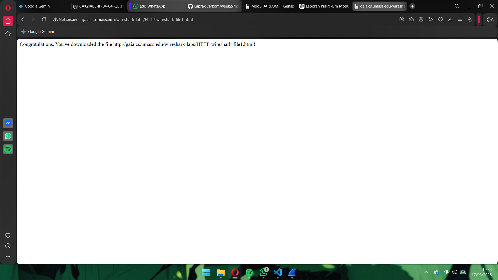

3. Setelah halaman berhasil ditampilkan, proses pengambilan paket pada Wireshark dihentikan.

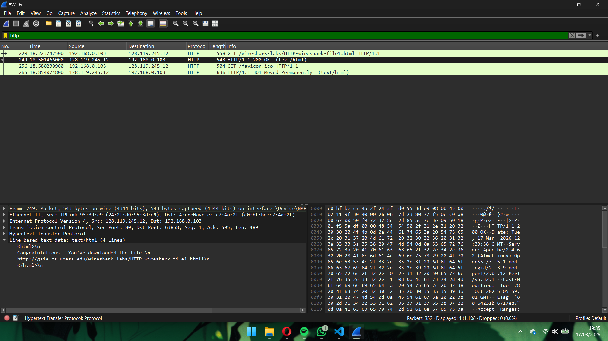
Pada jendela paket list, terlihat dua pesan HTTP yang dapat dilihat oleh Wireshark, yaitu GET request dari browser ke server gaia.cs.umass.edu dan response dari server ke browser. Jendela paket details menampilkan rincian pesan yang dipilih. Karena HTTP dikirim melalui TCP, IP, dan Ethernet, Wireshark juga menampilkan informasi dari layer tersebut.

## HTTP CONDITIONAL GET/response interaction

1. Pertama, jalankan browser dan pastikan cache serta history browser sudah dibersihkan. Selanjutnya, mulai jalankan kembali capture di Wireshark.
   
2. Masukkan URL http://gaia.cs.umass.edu/wireshark-labs/HTTP-wireshark-file2.html pada browser hingga halaman HTML sederhana yang berisi lima baris ditampilkan. Setelah itu, akses kembali URL yang sama dengan cepat atau tekan tombol refresh pada browser.
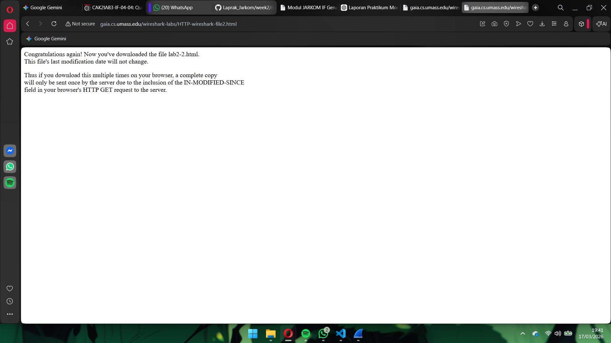

3. Setelah proses selesai, hentikan pengambilan paket pada Wireshark dan masukkan filter http pada kolom display filter agar hanya paket HTTP yang ditampilkan pada daftar paket.
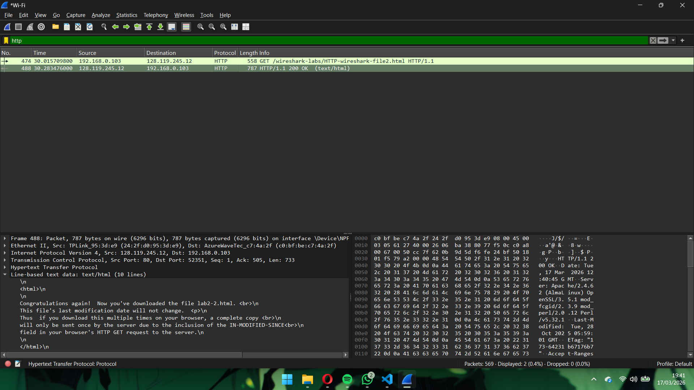

## Retrieving Long Documents

Pada percobaan melakukan pengamatan terhadap proses pengambilan file HTML berukuran besar menggunakan Wireshark.

1. Pertama, browser dijalankan dan cache serta history dibersihkan.
2. Selanjutnya proses paket capture dimulai menggunakan Wireshark. Kemudian pengguna mengakses URL http://gaia.cs.umass.edu/wireshark-labs/HTTP-wireshark-file3.html, sehingga browser menampilkan halaman Bill of Rights Amerika Serikat yang berukuran cukup panjang.
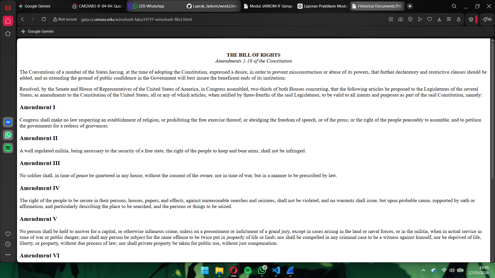

3. Setelah halaman berhasil dimuat, proses penangkapan paket dihentikan dan filter http diterapkan agar hanya paket HTTP yang ditampilkan.
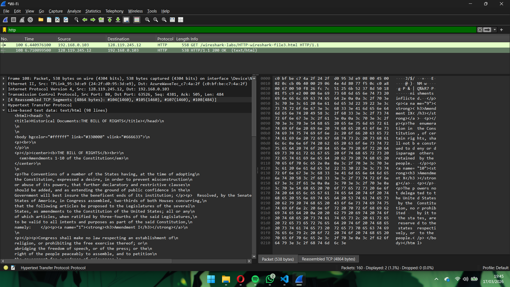
Pada paket list terlihat pesan HTTP GET diikuti oleh respons dari server yang terdiri dari beberapa segmen TCP. Data dikirim dalam beberapa segmen TCP yang kemudian digabungkan kembali oleh Wireshark menjadi satu data utuh yang ditandai dengan keterangan “TCP segment of a reassembled PDU” pada kolom Info.

## HTML Documents dengan Embedded Objects

Selanjutnya mencoba proses pengambilan file HTML yang memiliki objek tertanam (embedded objects) menggunakan Wireshark.

1. Pertama, browser dijalankan dan cache serta history dibersihkan. Setelah itu, proses paket capture dimulai menggunakan Wireshark
2. Selanjutnya pengguna mengakses URL http://gaia.cs.umass.edu/wireshark-labs/HTTP-wireshark-file4.html. Halaman yang ditampilkan berupa file HTML pendek yang memuat dua gambar. Gambar tersebut tidak berada langsung di dalam file HTML, melainkan direferensikan melalui URL sehingga browser harus mengambilnya dari server yang bersangkutan, yaitu situs gaia.cs.umass.edu.
3. Setelah halaman dimuat, proses penangkapan paket dihentikan dan filter http diterapkan agar hanya paket HTTP yang ditampilkan pada daftar paket di Wireshark.
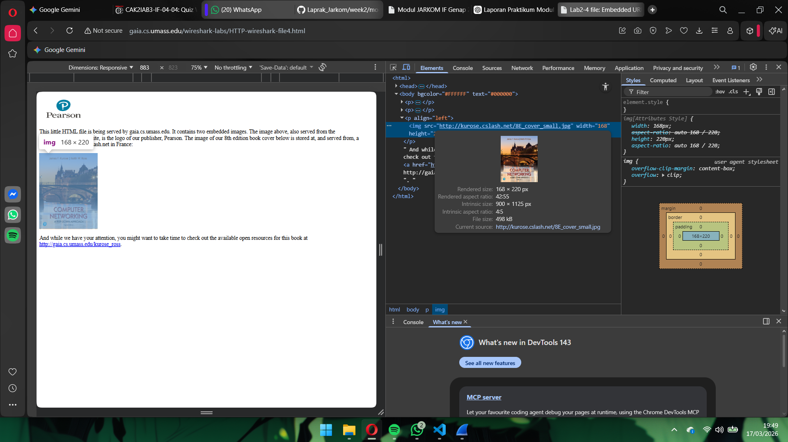
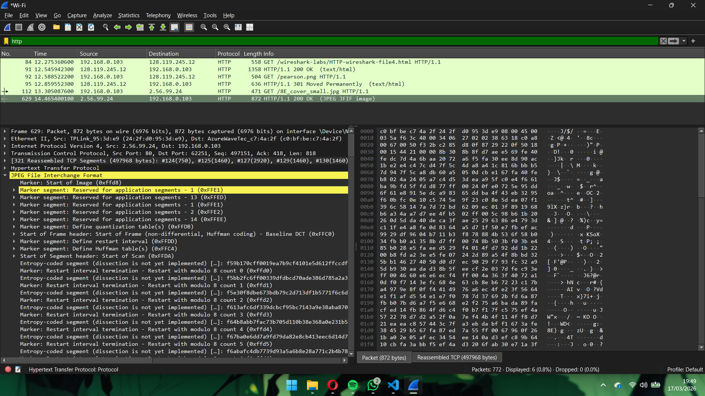
Berdasarkan hasil pengamatan gambar diatas dapat disimpulkan bahwa ketika sebuah halaman HTML memiliki objek yang disematkan (embedded objects) seperti gambar, browser tidak hanya mengambil file HTML utama saja. Browser juga akan mengirimkan request HTTP tambahan untuk setiap objek yang direferensikan dalam halaman tersebut. Setiap objek tersebut diambil melalui HTTP GET request yang terpisah dan server akan memberikan HTTP response sesuai dengan jenis file yang diminta.Lalu melakukan inspect pada halaman browser untuk mengetahui sumber dari gambar yang dimuat dalam halaman tersebut

## HTTP Authentication

Selanjutnya akan mencoba mengamati pertukaran pesan HTTP pada halaman yang dilindungi kata sandi menggunakan Wireshark.

1. Langkah pertama adalah menjalankan browser web dan memastikan cache serta history telah dibersihkan. Setelah itu, proses paket capture dimulai menggunakan Wireshark.

2. Selanjutnya, mengakses URL http://gaia.cs.umass.edu/wireshark-labs/protected_pages/HTTP-wireshark-file5.html. Ketika halaman diakses, browser akan menampilkan pop-up autentikasi yang meminta username dan password. Pengguna kemudian memasukkan username: wiresharkstudents dan password: network sesuai dengan yang telah ditentukan.
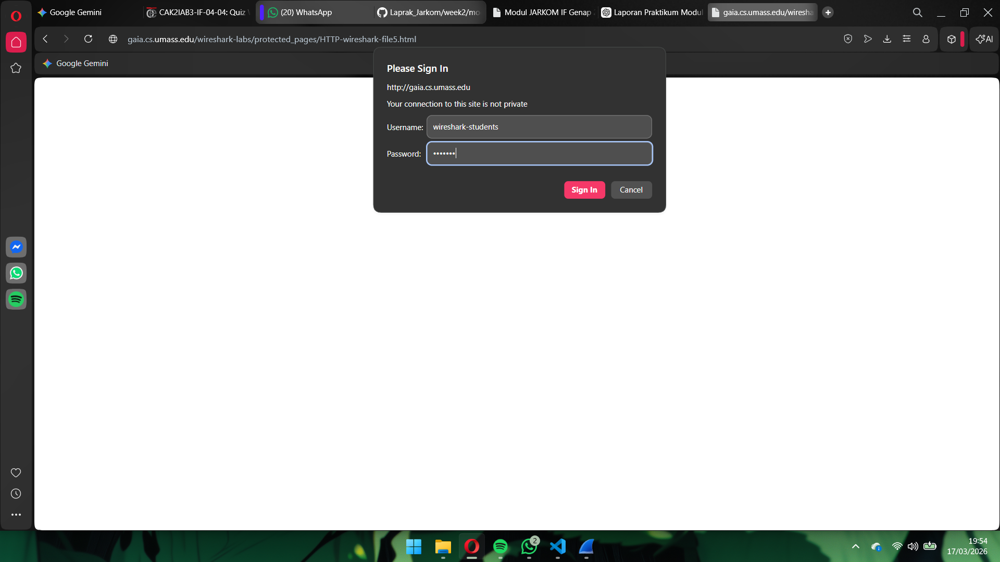
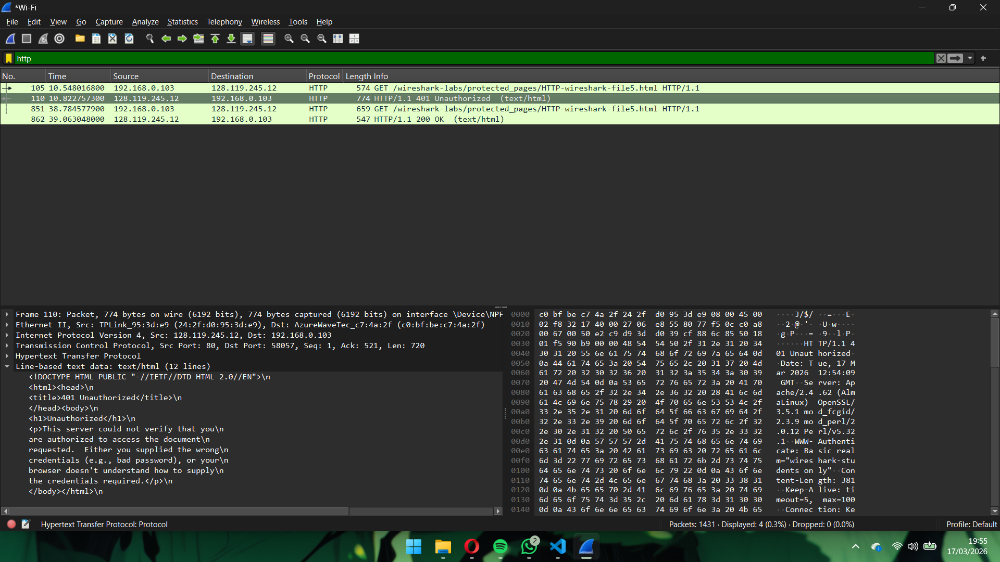

1. Setelah halaman berhasil diakses, proses penangkapan paket pada Wireshark dihentikan. Kemudian pada kolom display filter dimasukkan kata http agar hanya paket HTTP yang ditampilkan pada daftar paket.
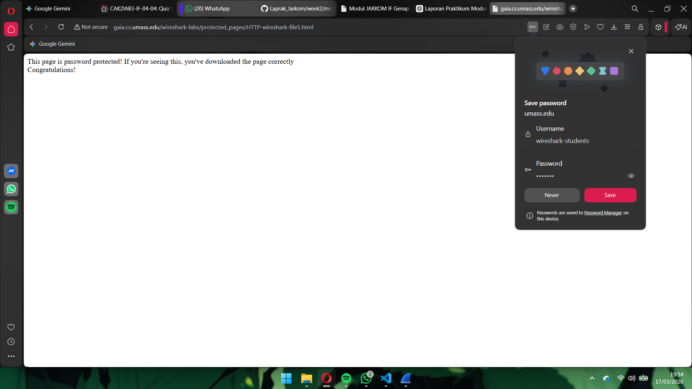
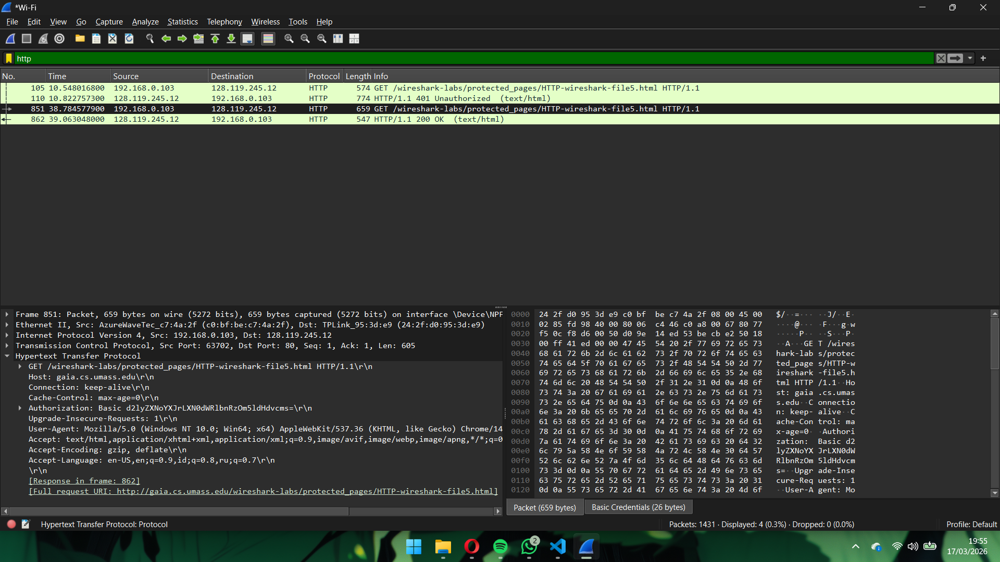

Berdasarkan hasil pengamatan pada gambar di atas, dapat dilihat bahwa ketika proses autentikasi dilakukan melalui protokol HTTP, informasi username dan password yang dimasukkan oleh pengguna dapat terlihat pada paket yang ditangkap menggunakan Wireshark. Hal ini terjadi karena HTTP tidak menggunakan mekanisme enkripsi, sehingga data yang dikirim antara browser dan server ditransmisikan dalam bentuk teks biasa (plain text). Hal ini bisa membahayakan penggunakan karna dapat menyebabkan kebocoran data pengguna dan dapat disalahgunakan oleh orang yang tidak bertanggung jawab.

## Bahaya HTTP
HTTP memiliki resiko keamanan tinggi karena tidak menggunakan enkripsi, sehingga data yang dikirim pengguna dapat dibaca secara langsung oleh pihak lain di jaringan. Oleh karena itu, saat ini sebagian besar website menggunakan HTTPS, yaitu HTTP yang dilindungi oleh protokol SSL/TLS sehingga proses komunikasi data menjadi terenkripsi. karena menggunakan HTTPS jadi informasi sensitif seperti username dan password tidak dikirim dalam bentuk plain text, melainkan dalam bentuk data terenkripsi, sehingga tidak dapat dengan mudah dibaca oleh pihak yang melakukan penyadapan jaringan.

## Kesimpulan 
Berdasarkan praktikum yang telah dilakukan , dapat disimpulkan bagaimana proses komunikasi data pada protokol HTTP terjadi antara browser dan server. Dari hasil diatas terlihat bahwa ketika sebuah halaman web diakses, browser akan mengirimkan HTTP request ke server dan server akan memberikan HTTP response yang berisi data yang diminta oleh pengguna.

Selain itu, jika halaman HTML memiliki objek yang disematkan (embedded objects) seperti gambar, browser akan mengirimkan beberapa request tambahan untuk mengambil setiap objek tersebut secara terpisah. Pada file HTML berukuran besar juga terlihat bahwa data dapat dikirim dalam beberapa segmen TCP karena ukuran file melebihi kapasitas satu paket.

Selain itu, menunjukkan jika situs yang menggunakan HTTP informasi sensitif seperti username dan password dapat terlihat pada paket yang ditangkap menggunakan Wireshark karena data dikirim dalam bentuk plain text. Hal ini menunjukkan bahwa HTTP memiliki risiko keamanan yang cukup tinggi.

