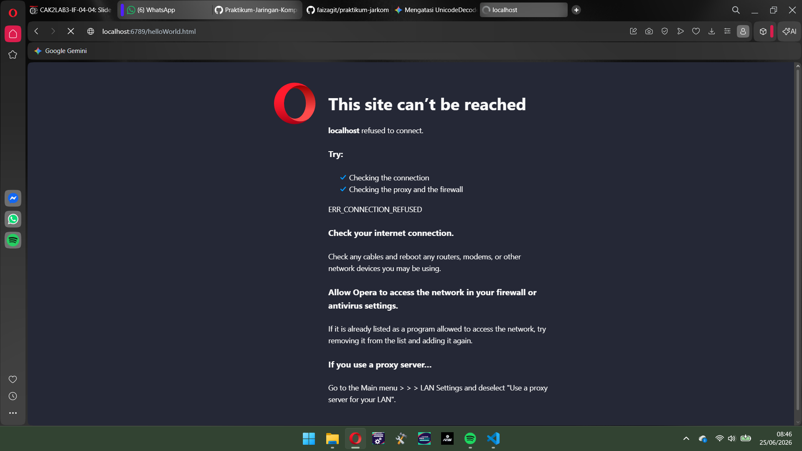
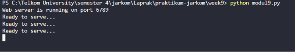
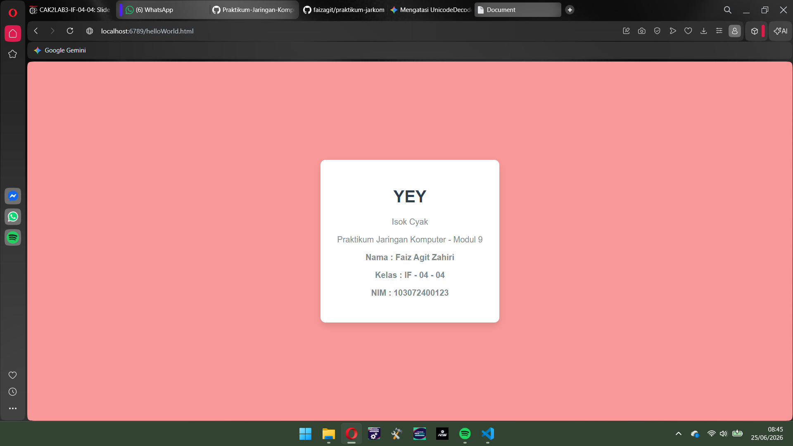
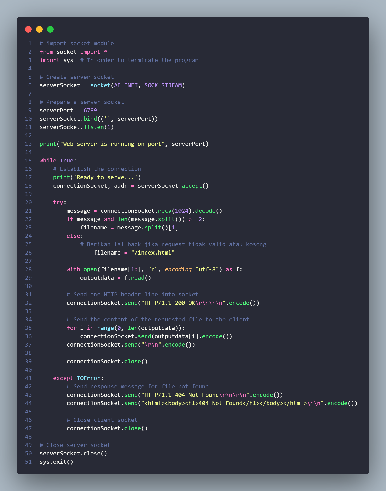

#### Nama : Faiz Agit Zahiri
#### NIM : 103072400123
#### Kelas : IF-04-04

# Web Server

Sebelum server dijalankan :

Setelah server dijalankan :

Kode :

Penjelasan :

1. Inisialisasi Socket
- SOCK_STREAM: Kita masih menggunakan TCP, jadi ini tetap konsisten.
- serverSocket.bind(('', serverPort)): Baris ini mengikat socket ke alamat IP lokal ('' berarti semua interface) dan port yang ditentukan. Ini seperti menempati sebuah meja di restoran, siap menerima tamu yang datang.

1. Mendengarkan (Listen)
- serverSocket.listen(1): Ini mengubah socket menjadi "pasif". Angka 1 adalah ukuran antrean (backlog), artinya server hanya bisa menampung satu calon client yang mengantre untuk dilayani sebelum mulai menolak koneksi baru. Dalam konteks web server sederhana ini, kita hanya menangani satu permintaan pada satu waktu.

1. Proses Jabat Tangan (Accept)
- connectionSocket, addr = serverSocket.accept(): Baris ini sangat penting. Saat ada client melakukan .connect(), baris ini akan "terbangun" dan menciptakan socket baru khusus untuk client tersebut (connectionSocket). Server tetap terjaga di pintu depan untuk menunggu tamu lain, sedangkan connectionSocket adalah jalur pribadi untuk mengobrol dengan tamu yang baru masuk.

1. Menerima Permintaan HTTP
- message = connectionSocket.recv(1024).decode(): Server menerima data dari client melalui connectionSocket. Data ini adalah permintaan HTTP yang dikirim oleh browser. Kita menggunakan .recv() untuk menangkap data tersebut, dan kemudian decode() untuk mengubahnya dari bytes menjadi string yang bisa kita baca.

1. Menangani Permintaan
- filename = message.split()[1]: Baris ini mengambil bagian kedua dari permintaan HTTP, yang biasanya adalah path ke file yang diminta. Misalnya, jika permintaan adalah "GET /index.html HTTP/1.1", maka filename akan menjadi "/index.html".

1. Membaca File dan Mengirim Balasan
- try: ... except IOError: Blok ini mencoba membuka file yang diminta. Jika file tidak ditemukan, akan terjadi IOError, dan server akan mengirimkan pesan "404 Not Found" sebagai balasan.

- connectionSocket.send(...): Jika file ditemukan, server membaca isinya dan mengirimkannya kembali ke client melalui connectionSocket. Jika file tidak ditemukan, server mengirimkan pesan kesalahan.

7. Menutup Koneksi
- connectionSocket.close(): Setelah satu transaksi selesai (menerima permintaan, memprosesnya, dan mengirim balasan), jalur pribadi ini ditutup. Namun, karena ini berada di dalam while True, server akan langsung naik lagi ke atas untuk menunggu accept() berikutnya, siap melayani permintaan berikutnya.